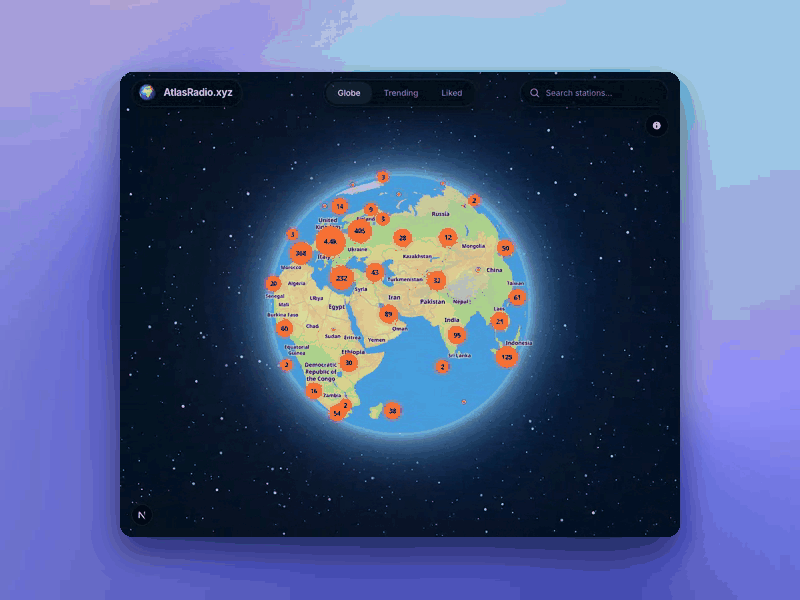

# Atlas Radio

**Live: [atlasradio.xyz](https://www.atlasradio.xyz)**

Spin a real 3D globe, drop in on any of 12,000+ live internet radio stations, and start listening. Free, no ads, no account.

<p align="center">
  
</p>

A Spotify-style web app for browsing and streaming free internet radio stations from around the world.

## Stack

- **Next.js** (App Router) + Tailwind CSS
- **Radio Browser API** ([radio-browser.info](https://www.radio-browser.info/)) — free, open station directory. No key required. The browser connects directly to each station's stream URL, so there's no audio bandwidth cost on our side.
- No backend or accounts. Liked stations are stored in the browser's `localStorage`.

## Setup

```bash
npm install
npm run dev
```

## Notes

- Deploys cleanly to Vercel's free tier. No environment variables are needed.
- The hero GIF above is a real capture of the live globe (comet, cluster splitting into dots, hover tooltip, tuning in), composited over an animated mesh gradient (`@paper-design/shaders`) — not a screenshot. It isn't part of the deployed app; only the finished `.github/preview.gif` is kept in the repo.

## Security

- A per-request, nonce-based Content-Security-Policy is set in `src/proxy.ts`; the other headers (HSTS, `X-Content-Type-Options`, `X-Frame-Options`, `Referrer-Policy`, `Permissions-Policy`, COOP) are in `next.config.ts`. The CSP only allows OpenFreeMap and the Radio Browser mirrors as third-party API origins.
- Station data comes from a public, community-edited directory and is treated as untrusted: `src/lib/sanitize.ts` validates every station (uuid shape, public `http(s)` stream and logo URLs only — no `javascript:`, loopback, LAN, link-local or cloud-metadata hosts) at the API, storage and player boundaries. Station text is only ever rendered as text.
- There is no backend state, no accounts and no secrets. `/api/stations/geo` proxies a fixed set of upstream hosts and clamps its only parameter.

## SEO and social previews

- Metadata, Open Graph and Twitter cards are set in `src/app/layout.tsx` and per view in `src/app/(app)/page.tsx`; `robots.txt`, `sitemap.xml`, the web manifest and the app icons are generated from `src/app/*.ts(x)`.
- Shared station links (`/?station=<uuid>`) get their own title, description and a generated preview image from `/api/og`. Search results and Liked are `noindex`.
- Production builds on Vercel default to `https://www.atlasradio.xyz`; set `NEXT_PUBLIC_SITE_URL` to override it (for example when the domain changes). It feeds canonical URLs, the sitemap and social image URLs.
